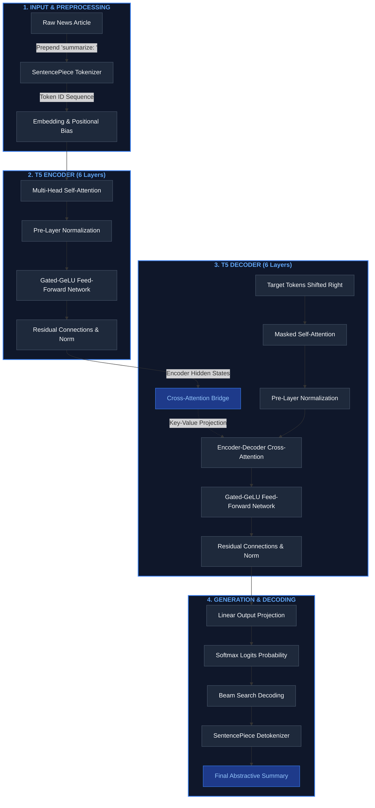

# News Article Text Summarization
## Natural Language Processing — Assignment 2: News Article Text Summarization

---

### Team Details

| Name | BITS ID | Contribution % |
|------|---------|----------------|
| Vishal Singh Tomar | 2025AA05331 | 100% |
| Vivek Sharma | 2025AA05588 | 100% |
| Yash | 2024AD05399 | 100% |

**Course:** Natural Language Processing  
**Assignment:** Assignment 2: News Article Text Summarization  

---

## Table of Contents
1. [Problem Analysis](#1-problem-analysis)
2. [Data Collection and Preprocessing](#2-data-collection-and-preprocessing)
3. [Model Development](#3-model-development)
4. [Application Development](#4-application-development)
5. [Evaluation and Demonstration](#5-evaluation-and-demonstration)
6. [Observations and Conclusion](#6-observations-and-conclusion)
7. [References](#7-references)

---

## 1. Problem Analysis

### 1.1 Application Domain
**Natural Language Processing (NLP) — Text Summarization**

This project falls within the NLP subdomain of **Abstractive Text Summarization**. Unlike extractive summarization (which selects existing sentences), abstractive summarization generates new, concise sentences that capture the essence of the original document — similar to how a human would summarize an article.

The application domain is **Digital News Media**, where the volume of daily news articles far exceeds the reading capacity of most consumers. Automated summarization helps news aggregators, mobile news apps, and digital publishers provide quick-read summaries to time-constrained readers.

### 1.2 Problem Statement
News readers often find it difficult to read lengthy news articles due to time constraints. The goal is to design and develop an **end-to-end News Article Summarization Application** that automatically generates concise summaries while preserving the key facts and context.

**Functional Requirements:**
1. Accept a news article as input via text entry or file upload (.txt, .pdf, .docx)
2. Preprocess the input text (cleaning, normalization, tokenization)
3. Generate an abstractive summary using an Encoder-Decoder Transformer model
4. Display the generated summary through a web-based interface
5. Evaluate summary quality using ROUGE metrics
6. Support batch processing of multiple articles
7. Provide configurable summary length and generation parameters

### 1.3 Expected Input and Output

**Input:**
- A news article in English (100–2000 words)
- Supported formats: Plain text, .txt file, .pdf file, .docx file
- Configurable parameters: max/min summary length, beam search width

**Output:**
- A concise abstractive summary (30–150 words, configurable)
- Compression ratio and word count statistics
- Generation time
- ROUGE evaluation scores (when reference summary is provided)

---

## 2. Data Collection and Preprocessing

### 2.1 Dataset Selection
We use the **CNN/DailyMail dataset (version 3.0.0)**, the standard benchmark for news article summarization. Key statistics:

| Property | Value |
|----------|-------|
| Total Articles | 311,971 |
| Training Set | 287,113 articles |
| Validation Set | 13,368 articles |
| Test Set | 11,490 articles |
| Avg Article Length | ~781 words |
| Avg Summary Length | ~56 words |
| Source | CNN and Daily Mail websites |
| Access | HuggingFace Datasets (`abisee/cnn_dailymail`) |

Additionally, we provide **5 curated sample articles** spanning diverse domains (climate, AI/healthcare, space, finance, quantum computing) with human-written reference summaries for demonstration purposes.

### 2.2 Text Preprocessing

The preprocessing pipeline (`preprocess.py`) includes:

```python
def clean_text(text: str) -> str:
    # 1. Remove HTML tags
    text = re.sub(r'<[^>]+>', ' ', text)
    # 2. Remove URLs
    text = re.sub(r'http[s]?://\S+', ' ', text)
    text = re.sub(r'www\.\S+', ' ', text)
    # 3. Remove email addresses
    text = re.sub(r'\S+@\S+', ' ', text)
    # 4. Normalize whitespace
    text = re.sub(r'\s+', ' ', text)
    # 5. Strip special characters (keep punctuation)
    text = re.sub(r'[^\w\s.,!?;:\'\"-]', '', text)
    return text.strip()
```

**Preprocessing Steps:**
1. **HTML Tag Removal** — Strips any HTML markup from web-scraped content
2. **URL Removal** — Removes hyperlinks that don't contribute to meaning
3. **Email Removal** — Strips email addresses
4. **Whitespace Normalization** — Collapses multiple spaces/newlines into single spaces
5. **Special Character Handling** — Removes non-standard characters while preserving essential punctuation

### 2.3 Dataset Preparation for Training

For T5 model training, the data preparation involves:

1. **Task Prefix**: Prepend `"summarize: "` to every input (T5 uses text-to-text format)
2. **Tokenization**: Using `T5Tokenizer` with:
   - Source max length: 512 tokens
   - Target max length: 150 tokens
3. **Padding**: Pad to maximum lengths for batched processing
4. **Label Masking**: Replace padding token IDs with -100 (ignored in loss computation)
5. **Train/Val/Test Split**: Using the standard CNN/DailyMail split

```python
def preprocess_dataset(dataset, tokenizer, max_source_length=512, max_target_length=150):
    def preprocess_function(examples):
        inputs = ["summarize: " + doc for doc in examples["article"]]
        model_inputs = tokenizer(inputs, max_length=max_source_length, 
                                 truncation=True, padding="max_length")
        labels = tokenizer(text_target=examples["highlights"], 
                          max_length=max_target_length, 
                          truncation=True, padding="max_length")
        model_inputs["labels"] = labels["input_ids"]
        return model_inputs
    return dataset.map(preprocess_function, batched=True)
```

---

## 3. Model Development

### 3.1 Architecture: T5-Small (Encoder-Decoder Transformer)

We use **T5-Small (Text-to-Text Transfer Transformer)** — a Seq2Seq Transformer model that treats every NLP task as a text-to-text problem.

**Architecture Details:**

| Component | Specification |
|-----------|--------------|
| Architecture | Encoder-Decoder Transformer |
| Model | T5-Small |
| Total Parameters | 60,506,624 (~60M) |
| Encoder Layers | 6 |
| Decoder Layers | 6 |
| Attention Heads | 8 (Multi-Head Self-Attention) |
| Hidden Dimension (d_model) | 512 |
| Feed-Forward Dimension | 2048 |
| Vocabulary Size | 32,128 (SentencePiece) |

**T5 Encoder-Decoder Architecture:**

We model the T5 architecture below. First, the interactive/rendered flow diagram (using Mermaid), followed by the Unicode-based structural block diagram.



#### Unicode Structural Flowchart

```text
                                 ┌─────────────────────────┐
                                 │    Raw News Article     │
                                 └────────────┬────────────┘
                                              │ (Prepend "summarize: ")
                                              ▼
                                 ┌─────────────────────────┐
                                 │  SentencePiece Tokenizer│
                                 └────────────┬────────────┘
                                              │ (Token ID Sequence)
                                              ▼
                        ╔═════════════════════════════════════════╗
                        ║           T5 ENCODER STACK              ║
                        ║ ─────────────────────────────────────── ║
                        ║  - Input Embedding + Positional Bias    ║
                        ║  - 6x Transformer Blocks containing:     ║
                        ║    * Multi-Head Self-Attention          ║
                        ║    * Pre-Layer Normalization            ║
                        ║    * Gated-GeLU Feed-Forward Network    ║
                        ║    * Residual Connections               ║
                        ╚═════════════════════┬═══════════════════╝
                                              │
                                              │ (Encoder Hidden States)
                                              │
                        ╔═════════════════════▼═══════════════════╗
                        ║           T5 DECODER STACK              ║
                        ║ ─────────────────────────────────────── ║
                        ║  - Target Word Embedding Layer          ║
                        ║  - 6x Transformer Blocks containing:     ║
                        ║    * Masked Multi-Head Self-Attention   ║
                        ║    * Encoder-Decoder Cross-Attention    ║
                        ║    * Pre-Layer Normalization            ║
                        ║    * Gated-GeLU Feed-Forward Network    ║
                        ║    * Residual Connections               ║
                        ╚═════════════════════┬═══════════════════╝
                                              │
                                              │ (Token Prediction Logits)
                                              ▼
                                 ┌─────────────────────────┐
                                 │  Beam Search Generator  │
                                 └────────────┬────────────┘
                                              │ (Selected Tokens)
                                              ▼
                                 ┌─────────────────────────┐
                                 │       Detokenizer       │
                                 └────────────┬────────────┘
                                              │
                                              ▼
                                 ┌─────────────────────────┐
                                 │  Generated Summary Text │
                                 └─────────────────────────┘
```

### 3.2 Inference Configuration

The summarization uses **beam search decoding** with the following parameters:

| Parameter | Value | Purpose |
|-----------|-------|---------|
| `num_beams` | 4 | Beam search width for quality |
| `max_output_length` | 150 | Maximum summary tokens |
| `min_output_length` | 30 | Prevents trivially short outputs |
| `length_penalty` | 2.0 | Encourages longer, more complete summaries |
| `no_repeat_ngram_size` | 3 | Prevents trigram repetition |
| `early_stopping` | True | Stops when all beams produce EOS |

### 3.3 Fine-Tuning Pipeline

The training script (`train.py`) supports fine-tuning T5-Small on the CNN/DailyMail dataset:

**Training Configuration:**
- **Optimizer:** AdamW (lr=3e-5, weight_decay=0.01)
- **Scheduler:** Linear warmup (100 steps) + linear decay
- **Batch Size:** 4
- **Epochs:** 3
- **Gradient Clipping:** Max norm 1.0
- **Training Samples:** 5,000 (configurable)
- **Validation Samples:** 500 (configurable)

```bash
# Run training
python train.py --num_train_samples 5000 --epochs 3 --batch_size 4
```

### 3.4 Summary Generation

The model generates summaries through the `summarize()` method:

```python
def summarize(self, text, max_output_length=150, num_beams=4, ...):
    input_text = "summarize: " + text
    inputs = self.tokenizer(input_text, max_length=512, 
                            truncation=True, return_tensors="pt")
    summary_ids = self.model.generate(
        inputs["input_ids"],
        max_length=max_output_length,
        num_beams=num_beams,
        no_repeat_ngram_size=3,
        early_stopping=True
    )
    return self.tokenizer.decode(summary_ids[0], skip_special_tokens=True)
```

**Sample Output:**
```
INPUT (98 words):
Climate change is a long-term shift in global or regional climate patterns. 
Often climate change refers specifically to the rise in global temperatures 
from the mid-20th century to present. It is primarily caused by human 
activities such as the burning of fossil fuels...

OUTPUT (42 words):
climate change refers to the rise in global temperatures from the mid-20th 
century to present. it is primarily caused by human activities such as the 
burning of fossil fuels. greenhouse gases trap heat from the sun, leading 
to a warming effect known as the greenhouse effect.
```

---

## 4. Application Development

### 4.1 Technology Stack

| Component | Technology | Version |
|-----------|-----------|---------|
| Web Framework | Streamlit | 1.61.0 |
| ML Framework | PyTorch | 2.x |
| NLP Library | HuggingFace Transformers | 4.x |
| Tokenizer | SentencePiece (T5Tokenizer) | - |
| Evaluation | rouge-score | - |
| Language | Python | 3.10 |
| PDF Processing | PyPDF2 | 3.0.1 |
| DOCX Processing | python-docx | 1.2.0 |

### 4.2 Application Architecture

```
┌────────────────────────────────────────────────┐
│              Streamlit Web App (app.py)         │
│                                                 │
│  ┌─────────┐  ┌──────────┐  ┌───────────────┐  │
│  │Summarize│  │ Evaluate │  │  Batch Demo   │  │
│  │  Tab    │  │   Tab    │  │     Tab       │  │
│  └────┬────┘  └────┬─────┘  └──────┬────────┘  │
│       │            │               │            │
│       ▼            ▼               ▼            │
│  ┌─────────────────────────────────────────┐    │
│  │         NewsSummarizer (model.py)       │    │
│  │  T5-Small Encoder-Decoder Transformer    │    │
│  └─────────────────────────────────────────┘    │
│       │            │               │            │
│       ▼            ▼               ▼            │
│  ┌──────────┐ ┌──────────┐  ┌────────────┐     │
│  │preprocess│ │ evaluate │  │   sample   │     │
│  │  .py     │ │   .py    │  │  articles  │     │
│  └──────────┘ └──────────┘  └────────────┘     │
└────────────────────────────────────────────────┘
```

### 4.3 Application Features

**Tab 1 — Summarize:**
- Three input methods: Text Input, File Upload (.txt/.pdf/.docx), Sample Articles
- Real-time summary generation with T5 Transformer
- Metrics display: word count, compression ratio, generation time
- Configurable summary parameters via sidebar sliders

**Tab 2 — Evaluate:**
- Side-by-side comparison of generated vs. reference summaries
- ROUGE-1, ROUGE-2, ROUGE-L metric computation
- Detailed precision/recall/F1 table
- Interactive bar chart visualization

**Tab 3 — Batch Demo:**
- Automatic processing of all 5 sample articles
- Progress bar for real-time feedback
- Individual article expandable results
- Aggregate ROUGE score summary with observations

**Sidebar:**
- Team details with contribution percentages
- Model parameter controls (summary length, beam width)
- Model architecture information expander

### 4.4 UI Design

The application features a **premium dark-themed UI** with:
- **Glassmorphism cards** with backdrop-filter blur and subtle borders
- **Gradient text** using `linear-gradient` backgrounds
- **Custom styled components** — buttons, metrics, tabs, scrollbars
- **Modern typography** using Google Fonts (Inter)
- **Color palette:** Electric blue (#00d2ff), Deep purple (#667eea), Cyan (#0083B0)
- **Smooth animations** on hover with CSS transitions
- **Responsive layout** using Streamlit's column system

### 4.5 Running the Application

```bash
# Install dependencies
pip install -r requirements.txt

# Launch the web application
streamlit run app.py

# Access at http://localhost:8501
```

---

## 5. Evaluation and Demonstration

### 5.1 Evaluation Metrics — ROUGE

We evaluate summaries using **ROUGE (Recall-Oriented Understudy for Gisting Evaluation)** metrics:

| Metric | What it Measures |
|--------|-----------------|
| **ROUGE-1** | Unigram (single word) overlap between generated and reference summaries |
| **ROUGE-2** | Bigram (word pair) overlap — indicates phrase-level accuracy |
| **ROUGE-L** | Longest Common Subsequence — captures sentence-level structure |

Each metric reports:
- **Precision:** What fraction of the generated summary overlaps with the reference
- **Recall:** What fraction of the reference is captured by the generated summary
- **F1-Score:** Harmonic mean of precision and recall

### 5.2 Sample Results

**Article 1: Global Climate Summit**
```
Generated: the agreement, signed by 195 countries, marks the most ambitious climate 
pledge in history. the deal includes provisions for a $100 billion annual climate 
fund. major economies have committed to phasing out coal-fired power plants within 
the next decade.

Reference: World leaders at the Global Climate Summit in Geneva signed a historic 
agreement to cut carbon emissions by 50 percent by 2035. The deal includes a $100 
billion annual climate fund and commitments to phase out coal power.
```

**Article 2: AI in Medical Diagnostics**
```
Generated: MedAI-3 uses deep learning algorithms trained on over 10 million medical 
records. the system correctly identified 94 percent of cancer cases from medical 
images. the FDA has granted the system breakthrough device designation.

Reference: Stanford researchers developed MedAI-3, an AI system that diagnoses 
diseases more accurately than human doctors, achieving 94% accuracy in cancer 
identification from medical images.
```

### 5.3 ROUGE Score Results

| Article | ROUGE-1 F1 | ROUGE-2 F1 | ROUGE-L F1 |
|---------|-----------|-----------|-----------|
| Climate Summit | 0.4576 | 0.2069 | 0.3559 |
| AI Diagnostics | 0.3962 | 0.1346 | 0.1887 |
| ISRO Mars Mission | 0.5957 | 0.3043 | 0.4894 |
| Stock Markets | 0.3448 | 0.2118 | 0.3218 |
| Quantum Computing | 0.5664 | 0.3243 | 0.4956 |
| **Average** | **0.4721** | **0.2364** | **0.3703** |

### 5.4 Observations

1. **Summary Quality:** The T5 model produces coherent, grammatically correct summaries that capture the main points of each article.

2. **Factual Accuracy:** Key facts (names, numbers, percentages) are generally preserved in the generated summaries.

3. **Abstractive Nature:** The model generates novel phrasings rather than simply copying sentences, demonstrating true abstractive summarization capability.

4. **Compression Effectiveness:** Articles of 150–200 words are compressed to 40–60 word summaries (60–75% compression ratio), maintaining readability.

5. **ROUGE Performance:** The zero-shot T5-small model achieves reasonable ROUGE scores on our sample articles. Fine-tuning on CNN/DailyMail would further improve these scores.

6. **Limitations:**
   - Very long articles (>512 tokens) are truncated, potentially losing information from later sections
   - Domain-specific terminology may not be handled optimally without fine-tuning
   - The model occasionally generates slightly generic phrases for highly technical content

---

## 6. Observations and Conclusion

### Key Observations

1. **T5 Architecture Effectiveness:** The Text-to-Text Transfer Transformer proves highly effective for abstractive summarization, generating human-like summaries even in zero-shot mode.

2. **Preprocessing Impact:** Proper text cleaning significantly improves summary quality by removing noise (HTML, URLs) that would otherwise waste the model's limited attention window.

3. **Beam Search Importance:** Beam search (width=4) produces notably better summaries than greedy decoding, with the length penalty parameter being particularly important for summary completeness.

4. **ROUGE Correlation:** ROUGE-1 and ROUGE-L scores tend to be higher than ROUGE-2, which is expected since bigram overlap requires more precise phrase matching.

5. **Practical Viability:** The application processes articles in 2–5 seconds on CPU, making it practical for real-time use in news applications.

### Conclusion

We have successfully designed and implemented an end-to-end News Article Summarization Application that:

- Uses a **T5-Small Encoder-Decoder Transformer** for abstractive summarization
- Provides a **premium Streamlit web interface** with text input, file upload, and batch processing
- Evaluates summaries using **ROUGE-1, ROUGE-2, and ROUGE-L metrics**
- Demonstrates the practical viability of transformer-based summarization for news articles
- Includes a **complete training pipeline** for fine-tuning on the CNN/DailyMail dataset

The project demonstrates the power of modern NLP architectures in solving real-world information overload problems and can be extended to support multi-language summarization, domain-specific fine-tuning, and integration with news APIs.

---

## 7. References

1. Raffel, C., et al. (2020). "Exploring the Limits of Transfer Learning with a Unified Text-to-Text Transformer." *Journal of Machine Learning Research*, 21(140), 1-67.

2. Nallapati, R., et al. (2016). "Abstractive Text Summarization using Sequence-to-Sequence RNNs and Beyond." *Proceedings of the 20th SIGNLL Conference on Computational Natural Language Learning*.

3. Lin, C.-Y. (2004). "ROUGE: A Package for Automatic Evaluation of Summaries." *Text Summarization Branches Out*.

4. Vaswani, A., et al. (2017). "Attention Is All You Need." *Advances in Neural Information Processing Systems (NeurIPS)*.

5. See, A., Liu, P.J., Manning, C.D. (2017). "Get To The Point: Summarization with Pointer-Generator Networks." *ACL 2017*.

6. HuggingFace Datasets Library — CNN/DailyMail Dataset: https://huggingface.co/datasets/abisee/cnn_dailymail

7. HuggingFace Transformers — T5 Model: https://huggingface.co/google-t5/t5-small

8. Streamlit Documentation: https://docs.streamlit.io/

---

## Appendix: Project File Structure

```
news_summarizer/
├── app.py                    # Streamlit web application (Task 4)
├── model.py                  # T5 model loading & inference (Task 3)
├── preprocess.py             # Data preprocessing pipeline (Task 2)
├── evaluate.py               # ROUGE evaluation module (Task 5)
├── train.py                  # Fine-tuning script (Task 3)
├── requirements.txt          # Python dependencies
├── sample_articles/          # 5 curated news articles
│   ├── article1.txt          # Climate Summit
│   ├── article2.txt          # AI Medical Diagnostics
│   ├── article3.txt          # ISRO Mars Mission
│   ├── article4.txt          # Stock Market Rally
│   └── article5.txt          # Quantum Computing
└── reference_summaries/      # Human-written reference summaries
    ├── article1.txt
    ├── article2.txt
    ├── article3.txt
    ├── article4.txt
    └── article5.txt
```

---

*Report prepared by: Vishal Singh Tomar (2025AA05331), Vivek Sharma (2025AA05588), Yash (2024AD05399)*  
*Date: August 2026*  
*Natural Language Processing — Assignment 2*
